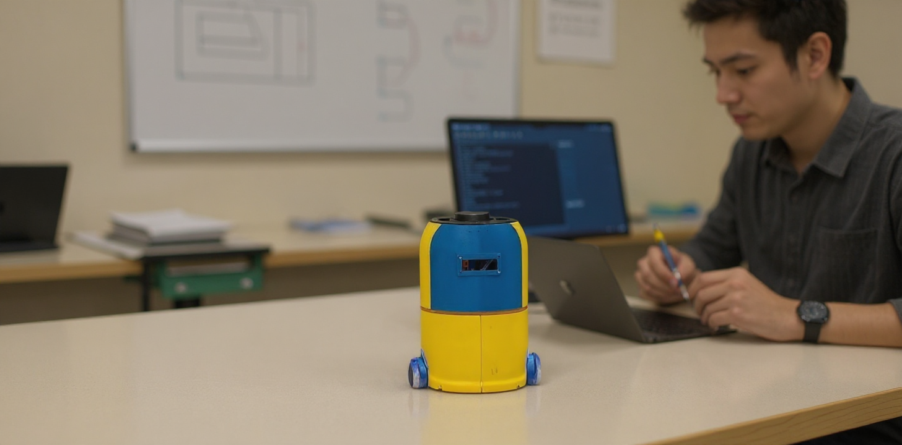
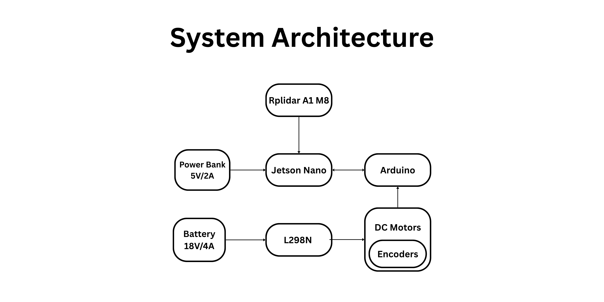

# MiniBot: Advanced Mobile Robotics Platform for Education

---



---


<div class="section-border">

## 1. Introduction

#### _This comprehensive guide will show you how to build a complete educational mobile robot from scratch using ROS 1 Melodic, Jetson Nano, and Arduino. You'll craft hardware assemblies, write custom ROS nodes, integrate LIDAR navigation, and actually make your robot move autonomously like a true roboticist_

</div>

---

<div class="section-border">

## 2. What is the _Minibot_ Educational Platform?

The **Minibot** isn't just another robot kit—it's a complete educational ecosystem designed to teach hardware integration, embedded programming, and AI/robotics concepts using **ROS 1 Melodic**. This platform bridges the gap between theory and practice by providing:

- Real-world hardware integration experience
- **ROS-based software architecture** understanding  
- Practical navigation and SLAM implementation
- Low-cost, accessible component selection

In a nutshell, the Minibot acts as your gateway to professional robotics development. Every component has been carefully selected to balance educational value, cost-effectiveness, and real-world applicability.

Imagine robotics education is a vast ocean. The **Minibot** is your well-equipped vessel that takes you from the shallow waters of theory to the deep seas of autonomous navigation. The platform comes with comprehensive documentation that guides you through every wave and current you'll encounter.

Yes, it might sound complex. But don't worry! This tutorial walks you through every single step—from selecting components to running autonomous navigation. We'll build everything modularly, so you can understand each subsystem before integrating the complete system. It's educational, it's practical, and honestly...it's the robot platform you wish existed when you started learning robotics!



Before we dive into the build process, here's an overview of the Minibot's key subsystems:

1. **Processing Unit (Jetson Nano)**:
   - Runs ROS 1 Melodic master node
   - Handles high-level navigation algorithms
   - Processes LIDAR data for SLAM
   - Manages system coordination and visualization

2. **Motor Control Subsystem**:
   - Arduino UNO for real-time motor control
   - L298N motor driver for power management
   - Encoder feedback for precise odometry
   - rosserial communication with ROS

3. **Sensor Integration**:
   - LIDAR for navigation and obstacle detection
   - Encoders for dead reckoning
   - Battery monitoring for system health
   - LCD display for status information

4. **Navigation Stack**:
   - SLAM using gmapping
   - Path planning with move_base
   - Costmap-based obstacle avoidance
   - tf tree for coordinate transformations

</div>

---

<div class="section-border">

## 3. Table of Contents

1. Introduction & Project Overview
2. Project Structure
3. Bill of Materials (BOM)
4. System Architecture
5. Hardware Assembly Guide
6. Circuit Diagrams & Wiring
7. Software Installation
8. Simulation Setup & Running the Robot in Simulation
9. Arduino Firmware Setup
10. ROS Integration
11. LIDAR Integration
12. Running the Robot on Real Hardware
13. Navigation Stack Setup
14. SLAM Configuration
15. Steps to Run the Robot

</div>

---

<div class="section-border">

## 4. Introduction & Project Overview

### Who This Guide Is For

This comprehensive tutorial is designed for:

- **Students** learning robotics and ROS fundamentals
- **Robotics enthusiasts** wanting hands-on experience
- **Developers** transitioning into robotics
- **Educators** seeking a complete teaching platform
- **Hobbyists** building their first autonomous robot

### What You'll Learn

By the end of this guide, you'll have:

✅ **Built a complete mobile robot** from individual components  
✅ **Mastered ROS 1 Melodic** installation and configuration  
✅ **Implemented rosserial communication** between ROS and Arduino  
✅ **Created custom ROS nodes** for motor control and navigation  
✅ **Integrated LIDAR** for autonomous navigation  
✅ **Configured SLAM** for real-time mapping  
✅ **Tuned navigation parameters** for optimal performance  
✅ **Debugged common robotics issues** you'll encounter in real projects

✅ **Simulated the robot** in Gazebo before hardware testing

✅ **Deployed on real hardware** with confidence

### Project Goals

This project demonstrates:

- **ROS Control Framework**: Custom hardware interface for real robot control
- **Arduino Integration**: Low-level motor control with encoder feedback
- **Navigation Stack**: Complete autonomous navigation with move_base
- **Simulation First**: Test everything in Gazebo before hardware deployment
- **Modular Design**: Each component can be tested independently
- **Educational Focus**: Clear explanations for learning robotics concepts

### Educational Philosophy

_"The best way to learn robotics is to build robots."_

This guide follows a hands-on approach where every concept is immediately applied to the physical system. You won't just read about coordinate transforms—you'll implement them. You won't just study SLAM algorithms—you'll watch your robot build maps in real-time.

</div>

---

<div class="section-border">

## 5. Project Structure

This project implements a complete ROS-based mobile robot system with hardware control, navigation, and simulation capabilities. The robot uses ROS Control framework for motor control, integrates with Arduino for low-level hardware interface, and includes full navigation stack configuration.

```
├── minibot/
│   ├── firmware.ino                    # Arduino firmware for motor control
│   └── src/
│       ├── mobile_robot/              # Main robot package
│       │   ├── config/
│       │   │   └── controllers.yaml   # ROS Control configuration
│       │   ├── launch/
│       │   │   ├── controller.launch  # Hardware interface launch
│       │   │   ├── amcl.launch        # Localization
│       │   │   ├── robot_description.launch
│       │   │   ├── sim_with_map.launch # Simulation with map
│       │   │   └── world.launch       # Gazebo world
│       │   ├── map/                   # Pre-built maps
│       │   ├── src/
│       │   │   └── diff_drive_hardware_interface.cpp # Hardware interface
│       │   ├── urdf/                  # Robot description files
│       │   │   ├── meshes/            # 3D models
│       │   │   ├── my_robo_hardware.urdf
│       │   │   └── my_robo_simulation.urdf
│       │   └── worlds/                # Gazebo world files
│       └── navigation/                # Navigation package
│           ├── config/                # Navigation parameters
│           ├── launch/
│           │   └── move_base.launch   # Navigation stack
│           └── rviz/                  # RViz configurations
```

### Key Features

#### Hardware Interface
- **ROS Control Integration**: Custom hardware interface for a differential drive robot
- **Arduino Communication**: rosserial-based communication with Arduino for motor control
- **Encoder Feedback**: Real-time encoder reading for odometry
- **Motor Control**: PWM-based motor control with smoothing and deadband

#### Navigation System
- **Move Base**: Complete navigation stack with global and local planning
- **Costmap Configuration**: Optimized costmaps for obstacle avoidance
- **Path Planning**: DWA local planner with configurable parameters
- **Localization**: AMCL for robot localization

#### Simulation Support
- **Gazebo Integration**: Full simulation environment with custom world
- **URDF Models**: Detailed robot description with 3D meshes
- **Map Support**: Pre-built maps for testing and development

</div>

---

<div class="section-border">

## 6. Bill of Materials (BOM)

### Core Hardware Components

| Component | Quantity | Purpose | Estimated Cost |
|-----------|----------|---------|----------------|
| **Jetson Nano** | 1 | Main processing unit for ROS 1 Melodic | $350 |
| **Arduino UNO** | 1 | Motor control and sensor interface | $6 |
| **L298N Motor Driver** | 1 | Drives two DC motors with current protection | $2 |
| **16x2 LCD Display** | 1 | System status and debugging information | $3 |
| **Encoder Motors (2x)** | 2 | DC motors with built-in encoders for odometry | $40 |
| **RPLIDAR A1M8** | 1 | 360° laser scanner for navigation | $99 |
| **Battery Pack (7.4V LiPo)** | 1 | Power supply for entire system | $30 |
| **Robot Chassis Kit** | 1 | Mechanical platform and wheels | $100 |
| **Jumper Wires & Connectors** | 1 set | Electrical connections | $3 |

**Total Estimated Cost: ~$633**

### Tools Required

- Soldering iron and solder
- Multimeter for electrical testing
- Screwdriver set
- Wire strippers
- Hot glue gun (optional)
- 3D printer access (optional, for custom mounts)

### Software Requirements

| Software | Version | Purpose |
|----------|---------|---------|
| **Ubuntu** | 18.04 LTS | Operating system for ROS 1 Melodic |
| **ROS 1** | Melodic | Robotic middleware framework |
| **Arduino IDE** | 1.8+ | Programming Arduino firmware |
| **Python** | 2.7| ROS node development |

</div>

---

<div class="section-border">

### Communication Architecture

The Minibot uses a distributed communication architecture:

1. **ROS Master Node** (Jetson Nano)
   - Coordinates all system components
   - Runs navigation algorithms
   - Processes sensor data

2. **Arduino Subsystem** (Microcontroller)
   - Real-time motor control
   - Encoder data acquisition
   - rosserial communication bridge

3. **Sensor Integration**
   - LIDAR data streaming
   - Odometry computation
   - System health monitoring

### Data Flow Diagram

```
                                                    ┌────────┐
                                                    │ LIDAR  │
                                                    └──┬─────┘
                                                       │
                                                       ▼
                                                  ┌────────────┐
                           ┌─────────────────────►│ ROS Topics │◄─────────────────┐
                           │                      └────┬───────┘                  │
                           │               ┌───────────┘                          │
                           │               ▼                                      │
                           │          ┌────────────┐     ┌─────────────┐          │
                           │          │  SLAM Node │────►│  Map Server │          │
                           │          └────┬───────┘     └────┬────────┘          │
                           │               │                  │                   │
                           │               ▼                  ▼                   │
                           │     ┌────────────┐         ┌────────────────┐        │
                           │     │Obstacle    │◄────────│ Local Costmap  │        │
                           │     │Detection   │         └────────────────┘        │
                           │     └────┬───────┘                                   │
                           │          │                                           │
                           │          ▼                                           │
                           │     ┌──────────────┐       ┌────────────────┐        │
                           │     │ Path Planner │──────►│ Global Planner │        │
                           │     └────┬─────────┘       └────┬───────────┘        │
                           │          │                      ▼                    │
                           │          ▼               ┌───────────────┐           │
                           │     ┌────────────┐       │Navigation Cmds│───────────┘
                           │     │   Arduino  │◄──────│   (cmd_vel)   │
                           │     └────┬───────┘       └───────────────┘
                           │          ▼
                           │     ┌─────────────┐
                           │     │ Motor Driver│
                           │     └────┬────────┘
                           │          ▼
                           │       ┌──────┐
                           │       │Wheels│
                           │       └──┬───┘
                           │          │
                           │          ▼
                           │     ┌─────────────┐
                           │     │  Encoders   │
                           │     └────┬────────┘
                           │          ▼
                           │     ┌─────────────┐
                           └─────│ Odometry    │
                                 └─────────────┘
```

---


# Power Distribution

Create a robust power distribution system:

1. **Main Power Bus**: 18V from LiPo battery
2. **5V Rail**: For Arduino, LCD, and logic circuits  
3. **12V Rail**: For motor driver 


**Power Budget Calculation:**
- Jetson Nano: ~10W (2A @ 5V)
- Arduino UNO: ~0.5W (100mA @ 5V)
- Motors: ~24W (2A @ 12V each)
- LIDAR: ~2.5W (500mA @ 5V)
- **Total: ~37W peak consumption**

# Component Integration

Install each major component with consideration for:

**Jetson Nano Placement:**
- Adequate ventilation for heat dissipation
- Access to GPIO pins for sensor connections
- USB ports for LIDAR and Arduino communication

**Arduino Positioning:**
- Close to motor driver for short signal paths
- Access to programming port
- Clear view of status LEDs

**LIDAR Mounting:**
- 360° unobstructed view
- Secure mounting to prevent vibration
- Appropriate height for navigation tasks

</div>

---

<div class="section-border">

## 7. Circuit Diagrams & Wiring

### Master Wiring Diagram

```
Jetson Nano GPIO Layout:
Pin 1  (3.3V)  ──► Logic Level Shifters
Pin 6  (GND)   ──► Common Ground
Pin 8  (GPIO14)──► Arduino Communication (Optional)
Pin 10 (GPIO15)──► Status LED

Arduino UNO Connections:
Digital Pin 2  ──► Motor 1 Encoder A
Digital Pin 3  ──► Motor 1 Encoder B  
Digital Pin 4  ──► Motor 2 Encoder A
Digital Pin 5  ──► Motor 2 Encoder B
Digital Pin 6  ──► Motor 1 PWM (L298N)
Digital Pin 7  ──► Motor 1 Direction 1
Digital Pin 8  ──► Motor 1 Direction 2
Digital Pin 9  ──► Motor 2 PWM (L298N)
Digital Pin 10 ──► Motor 2 Direction 1
Digital Pin 11 ──► Motor 2 Direction 2

```

### L298N Motor Driver Connections

```
L298N Pinout:
IN1, IN2 ──► Motor 1 Direction Control (from Arduino D7, D8)
IN3, IN4 ──► Motor 2 Direction Control (from Arduino D10, D11)
OUT1, OUT2 ──► Motor 1 Terminals
OUT3, OUT4 ──► Motor 2 Terminals
VCC      ──► 7.4V Battery Positive
GND      ──► Common Ground
5V OUT   ──► 5V Supply for Arduino (if needed)
```

### LIDAR Connection

```
RPLIDAR A1M8:

Connection: LIDAR ──► USB Port ──► Jetson Nano USB Port
```


</div>

---

<div class="section-border">

## 8. Software Installation

### Installing ROS 1 Melodic

```bash
# Step 1: Setup sources.list
sudo sh -c 'echo "deb http://packages.ros.org/ros/ubuntu $(lsb_release -sc) main" > /etc/apt/sources.list.d/ros-latest.list'

# Step 2: Setup keys
sudo apt-key adv --keyserver 'hkp://keyserver.ubuntu.com:80' --recv-key C1CF6E31E6BADE8868B172B4F42ED6FBAB17C654

# Step 3: Update package index
sudo apt update

# Step 4: Install ROS Melodic Desktop Full
sudo apt install ros-melodic-desktop-full

# Step 5: Initialize rosdep
sudo rosdep init
rosdep update

# Step 6: Setup environment
echo "source /opt/ros/melodic/setup.bash" >> ~/.bashrc
source ~/.bashrc

# Step 7: Install additional build tools
sudo apt install python-rosinstall python-rosinstall-generator python-wstool build-essential
```

### Installing Required ROS Packages

```bash
# Navigation stack
sudo apt install ros-melodic-move-base

# SLAM packages
sudo apt install ros-melodic-slam-gmapping
sudo apt install ros-melodic-map-server

# Visualization
sudo apt install ros-melodic-rviz

# Serial communication
sudo apt install ros-melodic-rosserial-arduino
sudo apt install ros-melodic-rosserial

# Teleoperation
sudo apt install ros-melodic-teleop-twist-keyboard

# LIDAR drivers
sudo apt install ros-melodic-rplidar-ros

# AMCL Package
sudo apt install ros-melodic-amcl
```

### Creating ROS Workspace

```bash
# Create catkin workspace
mkdir -p ~/minibot_ws/src
cd ~/minibot_ws/src
git clone https://github.com/muhammadsaadirfan/minibot.git
cd ~/minibot_ws/
catkin_make

# Source workspace
echo "source ~/minibot_ws/devel/setup.bash" >> ~/.bashrc
source ~/.bashrc
```

---

</div>

---

<div class="section-border">

## 9. Simulation Setup & Running the Robot in Simulation

### Why Start with Simulation?

Simulation provides a safe, cost-effective way to:
- **Test algorithms** without hardware risks
- **Debug software** issues quickly
- **Validate configurations** before hardware deployment
- **Learn ROS concepts** in a controlled environment
- **Save time** by catching issues early

### Installing Gazebo and Simulation Tools

```bash
# Install Gazebo and ROS control packages
sudo apt install ros-melodic-gazebo-ros-pkgs
sudo apt install ros-melodic-gazebo-ros-control
sudo apt install ros-melodic-gazebo-plugins
sudo apt install ros-melodic-gazebo-dev

# Install additional simulation tools
sudo apt install ros-melodic-robot-state-publisher
sudo apt install ros-melodic-joint-state-publisher
sudo apt install ros-melodic-joint-state-publisher-gui
```

### Launching Robot in Simulation

```bash
# Terminal 1: Start Gazebo with robot
roslaunch mobile_robot sim_with_map.launch

# Terminal 2: Launch navigation stack
roslaunch navigation move_base.launch

# Terminal 3: Start teleoperation (optional)
rosrun teleop_twist_keyboard teleop_twist_keyboard.py
```

### Simulation Features

#### Robot Model in Gazebo
- **Complete URDF**: Full robot description with meshes
- **Physics Engine**: Realistic physics simulation
- **Sensor Models**: LIDAR and encoder simulation
- **Collision Detection**: Proper obstacle avoidance

#### Available Worlds
- **Empty World**: Basic testing environment
- **Arena World**: Custom environment with obstacles
- **Office World**: Indoor navigation scenarios

### Testing in Simulation

#### 1. Basic Movement Test
```bash
# Send velocity commands
rostopic pub /cmd_vel geometry_msgs/Twist "linear: {x: 0.5, y: 0.0, z: 0.0}, angular: {x: 0.0, y: 0.0, z: 0.0}"

# Monitor robot movement
rostopic echo /odom
```

#### 2. Navigation Test
```bash
# Send navigation goal
rostopic pub /move_base_simple/goal geometry_msgs/PoseStamped "header: {frame_id: 'map'}, pose: {position: {x: 2.0, y: 2.0, z: 0.0}, orientation: {w: 1.0}}}"

# Monitor navigation status
rostopic echo /move_base/status
```

#### 3. SLAM Test
```bash
# Start SLAM mapping
rosrun gmapping slam_gmapping scan:=scan

# Save the generated map
rosrun map_server map_saver -f ~/catkin_ws/src/mobile_robot/map/simulated_map
```

### Simulation vs Real Hardware

| Aspect | Simulation | Real Hardware |
|--------|------------|---------------|
| **Safety** | ✅ No risk of damage | ⚠️ Physical safety required |
| **Speed** | ✅ Fast iteration | ⚠️ Slower debugging |
| **Cost** | ✅ Free | ⚠️ Hardware costs |
| **Realism** | ⚠️ Limited physics | ✅ Real-world conditions |
| **Sensors** | ⚠️ Simplified models | ✅ Actual sensor data |

### Troubleshooting Simulation

#### Common Issues
```bash
# Robot not moving in simulation
rostopic echo /cmd_vel  # Check if commands are received
rostopic echo /odom     # Check if robot responds

# LIDAR not working
rostopic echo /scan     # Check scan data
rosrun tf view_frames   # Check transforms

# Navigation not working
rostopic echo /move_base/status  # Check navigation status
rostopic echo /move_base/global_costmap/costmap  # Check costmap
```

#### Performance Optimization
```bash
# Reduce simulation load
export GAZEBO_MODEL_PATH=$GAZEBO_MODEL_PATH:~/catkin_ws/src/mobile_robot/worlds
export GAZEBO_RESOURCE_PATH=$GAZEBO_RESOURCE_PATH:~/catkin_ws/src/mobile_robot/worlds

# Use simpler physics engine
rosparam set /gazebo/physics/type "ode"
```

---

</div>

---

<div class="section-border">

## 10. Arduino Firmware Setup

### Installing Arduino IDE and Libraries

```bash
# Download and install Arduino IDE
wget https://downloads.arduino.cc/arduino-1.8.19-linux64.tar.xz
tar -xf arduino-1.8.19-linux64.tar.xz
cd arduino-1.8.19
sudo ./install.sh
```

### Required Arduino Libraries

Install these libraries through Arduino IDE Library Manager:

1. **Rosserial Arduino Library**
   - Enables ROS communication
   - Provides ROS message types

2. **Encoder Library**
   - Hardware interrupt-based encoder reading
   - Precise position tracking

3. **LiquidCrystal I2C**
   - LCD display communication
   - System status output

### Arduino Firmware Code Structure

```cpp
// minibot_arduino_firmware.ino
#include <ros.h>
#include <std_msgs/Int16.h>
#include <sensor_msgs/JointState.h>
#include <PinChangeInt.h>
#include <string.h>  

// ==== MOTOR ENCODER AND CONTROL PINS ====
#define ENC_A1  2     
#define ENC_B1  8     

#define ENC_A2  3     
#define ENC_B2  7     

#define M1A     9
#define M1B     10

#define M2A     5
#define M2B     6

#define COUNTS_PER_REV 246.0

// ==== Encoder Variables ====
volatile long encoderPos1 = 0;
volatile long encoderPos2 = 0;
volatile int dir1 = 1;
volatile int dir2 = 1;

// ==== Motor PWM Values ====
int pwm1 = 0;
int pwm2 = 0;

unsigned long lastTime = 0;

// ==== ROS Node Handle ====
ros::NodeHandle nh;

// ==== ROS Messages ====
sensor_msgs::JointState joint_state_msg;
char* joint_names[] = {"left_wheel_joint", "right_wheel_joint"};
float positions[2];
float velocities[2];

// ==== ROS Publisher ====
ros::Publisher joint_pub("joint_states", &joint_state_msg);

// ==== ROS Subscriber Callbacks ====
void pwm1_cb(const std_msgs::Int16 &cmd) {
  pwm1 = cmd.data;
}
void pwm2_cb(const std_msgs::Int16 &cmd) {
  pwm2 = cmd.data;
}

ros::Subscriber<std_msgs::Int16> pwm1_sub("motor1_cmd", &pwm1_cb);
ros::Subscriber<std_msgs::Int16> pwm2_sub("motor2_cmd", &pwm2_cb);

// ==== Setup ====
void setup() {
  // Encoder pins
  pinMode(ENC_A1, INPUT_PULLUP);
  pinMode(ENC_B1, INPUT_PULLUP);
  attachInterrupt(digitalPinToInterrupt(ENC_A1), encoderISR1, FALLING);

  pinMode(ENC_A2, INPUT_PULLUP);
  pinMode(ENC_B2, INPUT_PULLUP);
  attachInterrupt(digitalPinToInterrupt(ENC_A2), encoderISR2, FALLING);

  // Motor control pins
  pinMode(M1A, OUTPUT);
  pinMode(M1B, OUTPUT);
  pinMode(M2A, OUTPUT);
  pinMode(M2B, OUTPUT);

  // ROS Setup
  nh.initNode();
  nh.subscribe(pwm1_sub);
  nh.subscribe(pwm2_sub);
  nh.advertise(joint_pub);

  // Joint State Message setup
  joint_state_msg.name_length = 2;
  joint_state_msg.name = joint_names;
  joint_state_msg.position_length = 2;
  joint_state_msg.position = positions;
  joint_state_msg.velocity_length = 2;
  joint_state_msg.velocity = velocities;
}

// ==== Loop ====
void loop() {
  unsigned long now = millis();

  // Set motor speeds
  pwmOut(M1A, M1B, pwm1);
  pwmOut(M2A, M2B, pwm2);

  // Publish joint states every 100ms
  if (now - lastTime >= 100) {
    joint_state_msg.header.stamp = nh.now();

    joint_state_msg.position[0] = (2.0 * 3.1416 * encoderPos1) / COUNTS_PER_REV;
    joint_state_msg.position[1] = (2.0 * 3.1416 * encoderPos2) / COUNTS_PER_REV;

    joint_state_msg.velocity[0] = 0;  // Optional: implement real velocity
    joint_state_msg.velocity[1] = 0;

    joint_pub.publish(&joint_state_msg);
    lastTime = now;
  }

  nh.spinOnce();
  delay(10);
}

// ==== PWM Motor Output ====
void pwmOut(int pinA, int pinB, int out) {
  out = constrain(out, -255, 255);
  if (out >= 0) {
    analogWrite(pinA, 0);
    analogWrite(pinB, out);
  } else {
    analogWrite(pinA, -out);
    analogWrite(pinB, 0);
  }
}

// ==== Encoder Interrupt Service Routines (ISR) ====
void encoderISR1() {
  // ENC_B1 is on pin 8 → Port B bit 0 (PB0)
  if (PINB & (1 << 0)) {
    encoderPos1++;
    dir1 = 1;
  } else {
    encoderPos1--;
    dir1 = -1;
  }
}

void encoderISR2() {
  // ENC_B2 is on pin 7 → Port D bit 7 (PD7)
  if (PIND & (1 << 7)) {
    encoderPos2++;
    dir2 = 1;
  } else {
    encoderPos2--;
    dir2 = -1;
  }
}

```

### Uploading Firmware

1. **Connect Arduino to Your PC** via USB
2. **Select correct board and port** in Arduino IDE
3. **Compile and upload** the firmware
4. **Verify communication** using Serial Monitor

---

</div>

---

<div class="section-border">

## 11. ROS Integration

### Setting up rosserial Communication

Create a launch file for rosserial communication:

```xml
<!-- controller.launch -->
<launch>
  <!-- Load robot description -->
  <param name="robot_description" command="$(find xacro)/xacro --inorder '$(find mobile_robot)/urdf/my_robo_hardware.urdf'" />

  <!-- Publish joint states -->
  <node name="robot_state_publisher" pkg="robot_state_publisher" type="robot_state_publisher" />

  <!-- Load controller params -->
  <rosparam file="$(find mobile_robot)/config/controllers.yaml" command="load" />

  <!-- Hardware interface node -->
  <node name="hardware_interface" pkg="mobile_robot" type="diff_drive_hardware_interface" output="screen" />

  <!-- Spawner for joint state controller -->
  <node name="joint_state_spawner" pkg="controller_manager" type="spawner"
        args="joint_state_controller" output="screen" />

  <!-- Spawner for diff drive controller -->
  <node name="diff_drive_spawner" pkg="controller_manager" type="spawner"
        args="diff_drive_controller" output="screen">
 
  </node>
</launch>
```

### Creating Robot Description (URDF)

```xml
<!-- my_robo_hardware.urdf -->
<?xml version="1.0"?>	
<robot name="robot">

  <material name="Orange">
    <color rgba="0.5 0.2 0.0 1" />
  </material>
  <material name="Yellow">
    <color rgba="0.5 0.5 0.0 1" />
  </material>
  <material name="Black">
    <color rgba="0.5 0.0 0.0 1" />
  </material>
  <material name="Blue">
    <color rgba="0.0 0.0 0.4 1" />
  </material>
  <material name="Green">
    <color rgba="0.0 0.4 0.0 1" />
  </material>
  <material name="White">
    <color rgba="1 1 1 1" />
  </material>

  <link name="base_footprint" />

  <link name="base_link">
    <inertial>
      <origin xyz="0 0 0" rpy="0 0 0" />
      <mass value="70.0" />
      <inertia ixx="0.079945" ixy="0.00012078" ixz="0.00015606" iyy="0.068406" iyz="-0.0049053" izz="0.12343" />
    </inertial>
  <visual>
    <origin xyz="0 0 -0.015" rpy="0 0 -1.57" />
    <geometry>
      <mesh filename="package://mobile_robot/urdf/meshes/Base_Plate.stl" scale="0.001 0.001 0.001"/>
    </geometry>
    <material name="Blue" />
  </visual>
  <collision>
    <origin xyz="0 0 -0.015" rpy="0 0 -1.57" />
    <geometry>
      <mesh filename="package://mobile_robot/urdf/meshes/Base_Plate.stl" scale="0.001 0.001 0.001"/>
    </geometry>
  </collision>
  </link>

  <joint name="base_joint" type="fixed">
    <origin xyz="0 0 0.05335" rpy="0 0 0" />
    <parent link="base_footprint" />
    <child link="base_link" />
    <axis xyz="0 0 0" />
  </joint>

  <link name="robot_body_link">
    <inertial>
      <origin xyz="0 0 0" rpy="0 0 0" />
      <mass value="70.0" />
      <inertia ixx="0.079945" ixy="0.00012078" ixz="0.00015606" iyy="0.068406" iyz="-0.0049053" izz="0.12343" />
    </inertial>
  <visual>
    <origin xyz="0.0 0 -0.19125" rpy="0 0 -1.57" />
    <geometry>
      <mesh filename="package://mobile_robot/urdf/meshes/Robot_Cover_Full.stl" scale="0.001 0.001 0.001"/>
    </geometry>
    <material name="Yellow" />
  </visual>
  <collision>
    <origin xyz="0.0 0 -0.19125" rpy="0 0 -1.57" />
    <geometry>
      <mesh filename="package://mobile_robot/urdf/meshes/Robot_Cover_Full.stl" scale="0.001 0.001 0.001"/>
    </geometry>
  </collision>
  </link>

  <joint name="robot_body_joint" type="fixed">
    <origin xyz="0 0 0.175" rpy="0 0 0" />
    <parent link="base_link" />
    <child link="robot_body_link" />
    <axis xyz="0 0 0" />
  </joint>

  <link name="right_wheel_link">
    <inertial>
      <origin xyz="0.0 0.0 0.0" rpy="0 0 0" />
      <mass value="0.50917" />
      <inertia ixx="0.0012185" ixy="1.8059E-20" ixz="3.0427E-20" iyy="0.0012185" iyz="-4.0491E-20" izz="0.0022928" />
    </inertial>
    <visual>
      <origin xyz="0 0 0" rpy="0 0 0" />
      <geometry>
        <cylinder length="0.03" radius="0.04" />
      </geometry>
      <material name="Black" />
    </visual>
    <collision>
      <origin xyz="0 0 0" rpy="0 0 0" />
      <geometry>
        <cylinder length="0.03" radius="0.04" />
      </geometry>
    </collision>
  </link>

  <joint name="right_wheel_joint" type="continuous">
    <origin xyz="0.0 -0.12 0.01" rpy="1.571 0 0" />
    <parent link="base_link" />
    <child link="right_wheel_link" />
    <axis xyz="0 0 -1" />
  </joint>

  <link name="left_wheel_link">
    <inertial>
      <origin xyz="0.0 0.0 0.0" rpy="0 0 0" />
      <mass value="0.50917" />
      <inertia ixx="0.0012185" ixy="1.8059E-20" ixz="3.0427E-20" iyy="0.0012185" iyz="-4.0491E-20" izz="0.0022928" />
    </inertial>
    <visual>
      <origin xyz="0 0 0" rpy="0 0 0" />
      <geometry>
        <cylinder length="0.03" radius="0.04" />
      </geometry>
      <material name="Black" />
    </visual>
    <collision>
      <origin xyz="0 0 0" rpy="0 0 0" />
      <geometry>
        <cylinder length="0.03" radius="0.04" />
      </geometry>
    </collision>
  </link>

  <joint name="left_wheel_joint" type="continuous">
    <origin xyz="0.0 0.12 0.01" rpy="-1.571 0 0" />
    <parent link="base_link" />
    <child link="left_wheel_link" />
    <axis xyz="0 0 1" />
  </joint>

  <link name="lidar_link">
    <inertial>
      <origin xyz="0 0 0" rpy="0 0 0" />
      <mass value="0.0093378" />
      <inertia ixx="0" ixy="0" ixz="0" iyy="0" iyz="0" izz="0" /> 
    </inertial>
    <visual>
      <origin xyz="0 0 0" rpy="0 0 0" />
      <geometry>
        <cylinder length="0.046" radius="0.035" />
      </geometry>
      <material name="Green" />
    </visual>
    <collision>
      <origin xyz="0 0 0" rpy="0 0 0" />
      <geometry>
        <cylinder length="0.046" radius="0.035" />
      </geometry>
    </collision>
  </link>

  <joint name="laser_joint" type="fixed">
    <origin xyz="0.0075 0.0 0.35" rpy="0 0 3.14" />
    <parent link="base_link" />
    <child link="lidar_link" />
    <axis xyz="0 0 0" />
  </joint>

  <!-- Transmission (for ros_control) -->
  <transmission name="left_wheel_trans">
    <type>transmission_interface/SimpleTransmission</type>
    <joint name="left_wheel_joint">
      <hardwareInterface>hardware_interface/VelocityJointInterface</hardwareInterface>
    </joint>
    <actuator name="left_wheel_motor"><mechanicalReduction>1</mechanicalReduction></actuator>
  </transmission>

  <transmission name="right_wheel_trans">
    <type>transmission_interface/SimpleTransmission</type>
    <joint name="right_wheel_joint">
      <hardwareInterface>hardware_interface/VelocityJointInterface</hardwareInterface>
    </joint>
    <actuator name="right_wheel_motor"><mechanicalReduction>1</mechanicalReduction></actuator>
  </transmission>

</robot>
```
</robot>
```

### Custom ROS Nodes

#### Hardware Interface (C++)

```cpp
// File: src/diff_drive_hardware_interface.cpp

#include <ros/ros.h>
#include <controller_manager/controller_manager.h>
#include <hardware_interface/joint_command_interface.h>
#include <hardware_interface/joint_state_interface.h>
#include <hardware_interface/robot_hw.h>
#include <std_msgs/Int16.h>
#include <sensor_msgs/JointState.h>
#include <cmath>

class DiffDriveHardware : public hardware_interface::RobotHW {
public:
  DiffDriveHardware(ros::NodeHandle& nh) : nh_(nh) {
    for (int i = 0; i < 2; ++i) {
      pos_[i] = 0.0;
      vel_[i] = 0.0;
      eff_[i] = 0.0;
      cmd_[i] = 0.0;
      smoothed_cmd_[i] = 0.0;
    }

    // Register interfaces
    joint_state_interface_.registerHandle(hardware_interface::JointStateHandle("left_wheel_joint", &pos_[0], &vel_[0], &eff_[0]));
    joint_state_interface_.registerHandle(hardware_interface::JointStateHandle("right_wheel_joint", &pos_[1], &vel_[1], &eff_[1]));
    registerInterface(&joint_state_interface_);

    velocity_joint_interface_.registerHandle(hardware_interface::JointHandle(joint_state_interface_.getHandle("left_wheel_joint"), &cmd_[0]));
    velocity_joint_interface_.registerHandle(hardware_interface::JointHandle(joint_state_interface_.getHandle("right_wheel_joint"), &cmd_[1]));
    registerInterface(&velocity_joint_interface_);

    // ROS communication
    joint_state_sub_ = nh_.subscribe("/joint_states", 10, &DiffDriveHardware::jointStateCallback, this);
    motor1_pub_ = nh_.advertise<std_msgs::Int16>("/motor1_cmd", 10);
    motor2_pub_ = nh_.advertise<std_msgs::Int16>("/motor2_cmd", 10);
  }

  void read() {
    // Data updated from callback
  }

  void write() {
    std_msgs::Int16 msg1, msg2;
    const double velocity_to_pwm = 100.0;
    const double alpha = 0.7;  // smoothing factor
    const double deadband = 0.05;

    // Apply deadband
    for (int i = 0; i < 2; ++i) {
      if (std::abs(cmd_[i]) < deadband) cmd_[i] = 0.0;
    }

    // Apply smoothing
    smoothed_cmd_[0] = alpha * smoothed_cmd_[0] + (1.0 - alpha) * cmd_[0];
    smoothed_cmd_[1] = alpha * smoothed_cmd_[1] + (1.0 - alpha) * cmd_[1];

    int pwm1 = static_cast<int>(smoothed_cmd_[0] * velocity_to_pwm);
    int pwm2 = static_cast<int>(smoothed_cmd_[1] * velocity_to_pwm);

    // Clamp to PWM range
    pwm1 = std::max(-200, std::min(200, pwm1));
    pwm2 = std::max(-200, std::min(200, pwm2));

    msg1.data = pwm1;
    msg2.data = pwm2;

    motor1_pub_.publish(msg1);
    motor2_pub_.publish(msg2);
  }

  void jointStateCallback(const sensor_msgs::JointState::ConstPtr& msg) {
    if (msg->position.size() >= 2) {
      pos_[0] = msg->position[0];
      pos_[1] = msg->position[1];
    }
    if (msg->velocity.size() >= 2) {
      vel_[0] = msg->velocity[0];
      vel_[1] = msg->velocity[1];
    }
  }

private:
  ros::NodeHandle nh_;
  hardware_interface::JointStateInterface joint_state_interface_;
  hardware_interface::VelocityJointInterface velocity_joint_interface_;

  double pos_[2];
  double vel_[2];
  double eff_[2];
  double cmd_[2];
  double smoothed_cmd_[2];

  ros::Subscriber joint_state_sub_;
  ros::Publisher motor1_pub_;
  ros::Publisher motor2_pub_;
};

int main(int argc, char** argv) {
  ros::init(argc, argv, "diff_drive_hardware_interface");
  ros::NodeHandle nh;
  DiffDriveHardware robot(nh);
  controller_manager::ControllerManager cm(&robot, nh);

  ros::Duration(1.0).sleep();  // Let publishers/subscribers settle

  // Warmup: publish zero PWM to avoid jerks
  for (int i = 0; i < 5; ++i) {
    robot.write();
    ros::Duration(0.1).sleep();
  }

  ros::Rate rate(10);
  ros::AsyncSpinner spinner(1);
  spinner.start();

  while (ros::ok()) {
    robot.read();
    cm.update(ros::Time::now(), ros::Duration(0.1));
    robot.write();
    rate.sleep();
  }

  return 0;
}
```

---

</div>

---

<div class="section-border">

## 12. LIDAR Integration

### RPLIDAR ROS Package Setup

```bash
# Clone RPLIDAR ROS package
cd ~/minibot_ws/src
git clone https://github.com/Slamtec/rplidar_ros.git

# Build the package
cd ~/minibot_ws
catkin_make

# Source the workspace
source devel/setup.bash
```

### LIDAR Launch Configuration

```xml
<!-- minibot_lidar.launch -->
<launch>
    <!-- RPLIDAR A1 -->
    <node name="rplidarNode" pkg="rplidar_ros" type="rplidarNode" output="screen">
        <param name="serial_port" type="string" value="/dev/ttyUSB0"/>
        <param name="serial_baudrate" type="int" value="115200"/>
        <param name="frame_id" type="string" value="laser"/>
        <param name="inverted" type="bool" value="false"/>
        <param name="angle_compensate" type="bool" value="true"/>
    </node>
    
    <!-- Static transform from base_link to laser -->
    <node pkg="tf" type="static_transform_publisher" name="base_link_to_laser"
          args="0.1 0 0.1 0 0 0 base_link laser 50" />
</launch>
```

### Testing LIDAR Connection

```bash
# Test LIDAR connectivity
ls -la /dev/ttyUSB*

# Launch LIDAR node
roslaunch rplidar-ros rplidar.launch

# Verify LIDAR data in another terminal
rostopic echo /scan

# Check transform tree
rosrun tf view_frames
evince frames.pdf
```

### LIDAR Data Visualization

```bash
# Launch RViz with LIDAR visualization
rosrun rviz rviz

# In RViz:
# 1. Set Fixed Frame to "laser"
# 2. Add LaserScan display
# 3. Set Topic to "/scan"
# 4. Adjust settings for better visualization
```

---

</div>

---

<div class="section-border">

## 13. Running the Robot on Real Hardware

### Hardware Preparation Checklist

Before running on real hardware, ensure:

✅ **Arduino Firmware**: Uploaded and tested  
✅ **Hardware Assembly**: All components properly connected  
✅ **Power Supply**: Battery charged and voltage checked  
✅ **LIDAR**: Properly mounted and connected  
✅ **Motors**: Encoders working and wheels free to rotate  
✅ **Safety**: Emergency stop procedures ready  

### Pre-Hardware Testing

#### 1. Arduino Communication Test
```bash
# Test rosserial connection
rosrun rosserial_python serial_node.py _port:=/dev/ttyACM0 _baud:=57600

# Check if Arduino is publishing
rostopic echo /joint_states

# Test motor commands
rostopic pub /motor1_cmd std_msgs/Int16 "data: 100"
rostopic pub /motor2_cmd std_msgs/Int16 "data: 100"
```

#### 2. LIDAR Connection Test
```bash
# Check LIDAR connection
ls -la /dev/ttyUSB*

# Test LIDAR data
rosrun rplidar_ros rplidarNode _serial_port:=/dev/ttyUSB0

# Verify scan data
rostopic echo /scan
```

#### 3. Hardware Interface Test
```bash
# Launch hardware interface
roslaunch mobile_robot controller.launch

# Test velocity commands
rostopic pub /cmd_vel geometry_msgs/Twist "linear: {x: 0.1, y: 0.0, z: 0.0}, angular: {x: 0.0, y: 0.0, z: 0.0}"

# Monitor robot response
rostopic echo /odom
```

### Complete Hardware Launch Sequence

#### Step 1: Start Core System
```bash
# Terminal 1: Start roscore
roscore

# Terminal 2: Launch hardware interface
roslaunch mobile_robot controller.launch
```

#### Step 2: Start Sensors
```bash
# Terminal 3: Launch LIDAR
rosrun rplidar_ros rplidarNode _serial_port:=/dev/ttyUSB0 _serial_baudrate:=115200 _frame_id:=laser

# Terminal 4: Verify sensor data
rostopic echo /scan
rostopic echo /odom
```

#### Step 3: Start Navigation
```bash
# Terminal 5: Launch navigation stack
roslaunch navigation move_base.launch

# Terminal 6: Load map (if available)
rosrun map_server map_server /path/to/your/map.yaml

# Terminal 7: Start AMCL localization
roslaunch mobile_robot amcl.launch
```

#### Step 4: Start Visualization
```bash
# Terminal 8: Launch RViz
rosrun rviz rviz

# Configure RViz displays:
# - RobotModel
# - LaserScan (Topic: /scan)
# - Map (Topic: /map)
# - 2D Nav Goal tool
```


#### Environmental Factors
- **Lighting**: Ensure adequate lighting for LIDAR
- **Surface**: Test on different floor surfaces
- **Obstacles**: Start with simple environments
- **Space**: Ensure sufficient testing area

### Hardware vs Simulation Differences

| Feature | Simulation | Real Hardware |
|---------|------------|---------------|
| **Motor Response** | Instant | Physical inertia |
| **Sensor Noise** | Minimal | Real sensor noise |
| **Battery Life** | Unlimited | Limited runtime |
| **Environmental Factors** | Controlled | Variable conditions |
| **Safety** | No risk | Physical safety required |

### Troubleshooting Real Hardware

#### Common Hardware Issues
```bash
# Arduino not responding
sudo chmod 666 /dev/ttyACM0
rosrun rosserial_python serial_node.py _port:=/dev/ttyACM0 _baud:=57600

# LIDAR not detected
sudo chmod 666 /dev/ttyUSB0
lsusb | grep -i lidar

# Motors not moving
rostopic echo /motor1_cmd /motor2_cmd  # Check PWM values
rostopic echo /joint_states           # Check encoder data
```

#### Performance Tuning
```bash
# Adjust motor parameters
rosparam set /diff_drive_controller/wheel_radius 0.05
rosparam set /diff_drive_controller/wheel_separation 0.30

# Tune navigation parameters
rosparam set /move_base/TrajectoryPlannerROS/max_vel_x 0.3
rosparam set /move_base/TrajectoryPlannerROS/acc_lim_x 1.0
```

### Success Criteria

Your robot is ready when:
- ✅ Motors respond to velocity commands
- ✅ LIDAR provides consistent scan data
- ✅ Robot can navigate to goals autonomously
- ✅ Emergency stop works reliably
- ✅ Battery provides adequate runtime

---

</div>

---

<div class="section-border">

## 16. Steps to Run the Robot

### 1. Build the Workspace
```bash
# Navigate to your workspace
cd ~/catkin_ws

# Build the packages
catkin_make

# Source the workspace
source devel/setup.bash
```

### 2. Upload Arduino Firmware
```bash
# Open Arduino IDE
arduino

# Open firmware.ino file from minibot/firmware.ino
# Select correct board (Arduino UNO) and port
# Upload the firmware to Arduino
```

### 3. Start Hardware Interface
```bash
# Terminal 1: Start ros master 
roscore

# Terminal 2: Start rosserial communication
rosrun rosserial_python serial_node.py _port:=/dev/ttyACM0 _baud:=57600

# Terminal 3: Launch hardware interface
roslaunch mobile_robot controller.launch
```

### 4. Test Motor Control
```bash
# Terminal 3: Send velocity commands
rostopic pub /cmd_vel geometry_msgs/Twist "linear: {x: 0.2, y: 0.0, z: 0.0}, angular: {x: 0.0, y: 0.0, z: 0.0}"

# Stop the robot
rostopic pub /cmd_vel geometry_msgs/Twist "linear: {x: 0.0, y: 0.0, z: 0.0}, angular: {x: 0.0, y: 0.0, z: 0.0}"
```

### 5. Start LIDAR
```bash
# Terminal 4: Launch LIDAR
rosrun rplidar_ros rplidarNode _serial_port:=/dev/ttyUSB0 _serial_baudrate:=115200 _frame_id:=laser

# Check LIDAR data
rostopic echo /scan
```

### 6. Start Navigation Stack
```bash
# Terminal 5: Launch move_base
roslaunch navigation move_base.launch

# Terminal 6: Load map (if you want any custom)
rosrun map_server map_server /path/to/your/map.yaml

# Terminal 7: Start AMCL localization
roslaunch mobile_robot amcl.launch
```

### 7. Start RViz for Visualization
```bash
# Terminal 8: Launch RViz (if not launched, bcz it is launched by above launch files)
rosrun rviz rviz

# In RViz:
# 1. Set Fixed Frame to "map"
# 2. Add RobotModel display
# 3. Add LaserScan display (Topic: /scan)
# 4. Add Map display (Topic: /map)
# 5. Add 2D Nav Goal tool for navigation
```

### 8. Send Navigation Goals
```bash
# Method 1: Using RViz
# Click "2D Nav Goal" in RViz and set target location

# Method 2: Using command line
rostopic pub /move_base_simple/goal geometry_msgs/PoseStamped "header: {frame_id: 'map'}, pose: {position: {x: 1.0, y: 1.0, z: 0.0}, orientation: {w: 1.0}}}"
```

### 9. Monitor System Status
```bash
# Check all running nodes
rosnode list

# Check all topics
rostopic list

# Monitor robot position
rostopic echo /odom

# Monitor navigation status
rostopic echo /move_base/status
```


---

</div>

---

<div class="section-border">

---

## 🙏 Thank You!

Thank you for exploring this project. I hope this educational mobile robot empowers you to dive deeper into robotics, hands-on learning, and real-world system integration. Your interest and dedication to building robots is what drives innovation in this field.

If you have **any suggestions, feedback, or improvements**, feel free to open an issue or reach out to me directly. Collaboration and learning go hand in hand, and I'd love to hear from you!

---

## 👤 About the Author

**Muhammad Saad**  
🎓 Mechatronics and Control Engineering Student  
🏫 University of Engineering and Technology, Lahore  
📍 Lahore, Pakistan  
📧 Email: [msaadmceu@gmail.com](mailto:msaadmceu@gmail.com)


