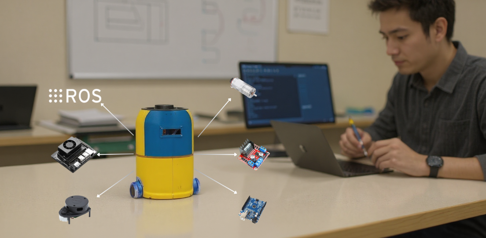

# Minibot: From Chassis to Code — Learn Mobile Robotics Step-by-Step



---

## Introduction

#### _This comprehensive guide will show you how to build a complete educational mobile robot from scratch using ROS 1 Melodic, Jetson Nano, and Arduino. You'll craft hardware assemblies, write custom ROS nodes, integrate LIDAR navigation, and actually make your robot move autonomously like a true robotics scholar. Yes, yes—there'll be launch files, YAML configs, rosserial communication, and other ancient rituals. The robot still won't thank you. But your students will. Definitely._

---

## What is the _Minibot_ Educational Platform?

The **Minibot** isn't just another robot kit—it's a complete educational ecosystem designed to teach hardware integration, embedded programming, and AI/robotics concepts using **ROS 1 Melodic**. This platform bridges the gap between theory and practice by providing:

- Real-world hardware integration experience
- **ROS-based software architecture** understanding  
- Practical navigation and SLAM implementation
- Low-cost, accessible component selection

In a nutshell, the Minibot acts as your gateway to professional robotics development. Every component has been carefully selected to balance educational value, cost-effectiveness, and real-world applicability.

Imagine robotics education is a vast ocean. The **Minibot** is your well-equipped vessel that takes you from the shallow waters of theory to the deep seas of autonomous navigation. The platform comes with comprehensive documentation that guides you through every wave and current you'll encounter.

Yes, it might sound complex. But don't worry! This tutorial walks you through every single step—from selecting components to running autonomous navigation. We'll build everything modularly, so you can understand each subsystem before integrating the complete system. It's educational, it's practical, and honestly......it's the robot platform you wish existed when you started learning robotics!

![System Architecture Diagram - Add complete system overview here]

Before we dive into the build process, here's an overview of the Minibot's key subsystems:

1. **Processing Unit (Jetson Nano)**:
   - Runs ROS 1 Melodic master node
   - Handles high-level navigation algorithms
   - Processes LIDAR data for SLAM
   - Manages system coordination and visualization

2. **Motor Control Subsystem**:
   - Arduino UNO for real-time motor control
   - L298N motor driver for power management
   - Encoder feedback for precise odometry
   - rosserial communication with ROS

3. **Sensor Integration**:
   - LIDAR for navigation and obstacle detection
   - Encoders for dead reckoning
   - Battery monitoring for system health
   - LCD display for status information

4. **Navigation Stack**:
   - SLAM using gmapping
   - Path planning with move_base
   - Costmap-based obstacle avoidance
   - tf tree for coordinate transformations

---

## Table of Contents

1. [Introduction & Project Overview](#introduction)
2. [Bill of Materials (BOM)](#bill-of-materials)
3. [System Architecture](#system-architecture)
4. [Hardware Assembly Guide](#hardware-assembly)
5. [Circuit Diagrams & Wiring](#circuit-diagrams)
6. [Software Installation](#software-installation)
7. [Arduino Firmware Setup](#arduino-firmware)
8. [ROS Integration](#ros-integration)
9. [Motor Control Implementation](#motor-control)
10. [LIDAR Integration](#lidar-integration)
11. [Navigation Stack Setup](#navigation-stack)
12. [SLAM Configuration](#slam-configuration)
13. [Testing & Debugging](#testing-debugging)
14. [Complete System Launch](#system-launch)
15. [Future Improvements](#future-improvements)
16. [Troubleshooting](#troubleshooting)

---

## Introduction & Project Overview {#introduction}

### Who This Guide Is For

This comprehensive tutorial is designed for:

- **Students** learning robotics and ROS fundamentals
- **Robotics enthusiasts** wanting hands-on experience
- **Developers** transitioning into robotics
- **Educators** seeking a complete teaching platform

### What You'll Learn

By the end of this guide, you'll have:

✅ **Built a complete mobile robot** from individual components  
✅ **Mastered ROS 1 Melodic** installation and configuration  
✅ **Implemented rosserial communication** between ROS and Arduino  
✅ **Created custom ROS nodes** for motor control and navigation  
✅ **Integrated LIDAR** for autonomous navigation  
✅ **Configured SLAM** for real-time mapping  
✅ **Tuned navigation parameters** for optimal performance  
✅ **Debugged common robotics issues** you'll encounter in real projects

### Educational Philosophy

_"The best way to learn robotics is to build robots."_

This guide follows a hands-on approach where every concept is immediately applied to the physical system. You won't just read about coordinate transforms—you'll implement them. You won't just study SLAM algorithms—you'll watch your robot build maps in real-time.

---

## Bill of Materials (BOM) {#bill-of-materials}

### Core Hardware Components

| Component | Quantity | Purpose | Estimated Cost |
|-----------|----------|---------|----------------|
| **Jetson Nano** | 1 | Main processing unit for ROS 1 Melodic | $99 |
| **Arduino UNO** | 1 | Motor control and sensor interface | $25 |
| **L298N Motor Driver** | 1 | Drives two DC motors with current protection | $8 |
| **16x2 LCD Display** | 1 | System status and debugging information | $10 |
| **Encoder Motors (2x)** | 2 | DC motors with built-in encoders for odometry | $40 |
| **RPLIDAR A1M8** | 1 | 360° laser scanner for navigation | $99 |
| **Battery Pack (7.4V LiPo)** | 1 | Power supply for entire system | $30 |
| **Robot Chassis Kit** | 1 | Mechanical platform and wheels | $25 |
| **Jumper Wires & Connectors** | 1 set | Electrical connections | $15 |

**Total Estimated Cost: ~$351**

### Tools Required

- Soldering iron and solder
- Multimeter for electrical testing
- Screwdriver set
- Wire strippers
- Hot glue gun (optional)
- 3D printer access (optional, for custom mounts)

### Software Requirements

| Software | Version | Purpose |
|----------|---------|---------|
| **Ubuntu** | 18.04 LTS | Operating system for ROS 1 Melodic |
| **ROS 1** | Melodic | Robotic middleware framework |
| **Arduino IDE** | 1.8+ | Programming Arduino firmware |
| **Python** | 2.7/3.6 | ROS node development |

---

## System Architecture {#system-architecture}

### High-Level System Overview

```
┌─────────────────┐    ┌─────────────────┐    ┌─────────────────┐
│   ROS Master    │    │   LIDAR Sensor  │    │  Battery Pack   │
│  (Jetson Nano)  │    │   (Navigation)  │    │   (Power Dist)  │
└─────────┬───────┘    └─────────┬───────┘    └─────────┬───────┘
          │                      │                      │
          ├──────────────────────┼──────────────────────┤
          │                      │                      │
┌─────────▼───────┐    ┌─────────▼───────┐    ┌─────────▼───────┐
│ Motor Control   │    │  Sensor Fusion │    │ System Monitor  │
│   (Arduino)     │    │    (ROS Node)   │    │   (LCD Display) │
└─────────┬───────┘    └─────────────────┘    └─────────────────┘
          │
          ▼
┌─────────────────┐
│  L298N Driver   │
│  (Motor Power)  │
└─────────┬───────┘
          │
          ▼
┌─────────────────┐
│ Encoder Motors  │
│  (Locomotion)   │
└─────────────────┘
```

### Communication Architecture

The Minibot uses a distributed communication architecture:

1. **ROS Master Node** (Jetson Nano)
   - Coordinates all system components
   - Runs navigation algorithms
   - Processes sensor data

2. **Arduino Subsystem** (Microcontroller)
   - Real-time motor control
   - Encoder data acquisition
   - rosserial communication bridge

3. **Sensor Integration**
   - LIDAR data streaming
   - Odometry computation
   - System health monitoring

### Data Flow Diagram

```
LIDAR ──► ROS Topics ──► SLAM Node ──► Map
  │                        │           │
  │                        ▼           ▼
  └──► Obstacle ──► Path Planner ──► Navigation
      Detection              │         Commands
                             │           │
                             ▼           ▼
                        Arduino ──► Motor Driver ──► Wheels
                             ▲           
                             │           
                        Encoders ──► Odometry ──► ROS Topics
```

---

## Hardware Assembly Guide {#hardware-assembly}

### Step 1: Chassis Preparation

First, let's prepare the mechanical foundation:

```bash
# Tools needed for this step:
# - Screwdriver set
# - Drill (if custom mounting holes needed)
```

1. **Unpack the chassis kit** and identify all components
2. **Mount the motors** to the chassis using provided brackets
3. **Install wheels** and ensure smooth rotation
4. **Create mounting points** for electronics (Jetson Nano, Arduino, battery)

### Step 2: Electronics Mounting

Strategic component placement is crucial for:
- Heat dissipation (Jetson Nano)
- Wire management
- Accessibility for debugging
- Weight distribution

**Recommended Layout:**
```
     [LIDAR]
        │
[Battery]──[Jetson Nano]
    │          │
[Arduino]──[L298N]──[Motors]
    │
  [LCD]
```

### Step 3: Power Distribution

Create a robust power distribution system:

1. **Main Power Bus**: 7.4V from LiPo battery
2. **5V Rail**: For Arduino, LCD, and logic circuits  
3. **12V Rail**: For motor driver (if using 12V motors)
4. **3.3V Rail**: For sensor interfaces

**Power Budget Calculation:**
- Jetson Nano: ~10W (2A @ 5V)
- Arduino UNO: ~0.5W (100mA @ 5V)
- Motors: ~24W (2A @ 12V each)
- LIDAR: ~2.5W (500mA @ 5V)
- **Total: ~37W peak consumption**

### Step 4: Component Integration

Install each major component with consideration for:

**Jetson Nano Placement:**
- Adequate ventilation for heat dissipation
- Access to GPIO pins for sensor connections
- USB ports for LIDAR and Arduino communication

**Arduino Positioning:**
- Close to motor driver for short signal paths
- Access to programming port
- Clear view of status LEDs

**LIDAR Mounting:**
- 360° unobstructed view
- Secure mounting to prevent vibration
- Appropriate height for navigation tasks

---

## Circuit Diagrams & Wiring {#circuit-diagrams}

### Master Wiring Diagram

```
Jetson Nano GPIO Layout:
Pin 1  (3.3V)  ──► Logic Level Shifters
Pin 6  (GND)   ──► Common Ground
Pin 8  (GPIO14)──► Arduino Communication (Optional)
Pin 10 (GPIO15)──► Status LED

Arduino UNO Connections:
Digital Pin 2  ──► Motor 1 Encoder A
Digital Pin 3  ──► Motor 1 Encoder B  
Digital Pin 4  ──► Motor 2 Encoder A
Digital Pin 5  ──► Motor 2 Encoder B
Digital Pin 6  ──► Motor 1 PWM (L298N)
Digital Pin 7  ──► Motor 1 Direction 1
Digital Pin 8  ──► Motor 1 Direction 2
Digital Pin 9  ──► Motor 2 PWM (L298N)
Digital Pin 10 ──► Motor 2 Direction 1
Digital Pin 11 ──► Motor 2 Direction 2

Analog Pin A4  ──► LCD SDA
Analog Pin A5  ──► LCD SCL
```

### L298N Motor Driver Connections

```
L298N Pinout:
IN1, IN2 ──► Motor 1 Direction Control (from Arduino D7, D8)
IN3, IN4 ──► Motor 2 Direction Control (from Arduino D10, D11)
ENA      ──► Motor 1 PWM Speed Control (from Arduino D6)
ENB      ──► Motor 2 PWM Speed Control (from Arduino D9)
OUT1, OUT2 ──► Motor 1 Terminals
OUT3, OUT4 ──► Motor 2 Terminals
VCC      ──► 7.4V Battery Positive
GND      ──► Common Ground
5V OUT   ──► 5V Supply for Arduino (if needed)
```

### LIDAR Connection

```
RPLIDAR A1M8:
Red Wire    ──► 5V Power Supply
Black Wire  ──► Ground
Green Wire  ──► USB Data+ (via USB adapter)
White Wire  ──► USB Data- (via USB adapter)

Connection: LIDAR ──► USB Hub ──► Jetson Nano USB Port
```

### Power Distribution Schematic

```
Battery (7.4V LiPo)
    │
    ├──► L298N Motor Driver (7.4V Input)
    │       │
    │       └──► 5V Regulator Output ──► Arduino VIN
    │
    └──► Buck Converter (7.4V → 5V, 3A)
            │
            ├──► Jetson Nano (5V, 2A)
            ├──► LIDAR (5V, 500mA)
            └──► LCD Display (5V, 50mA)
```

---

## Software Installation {#software-installation}

### Installing Ubuntu 18.04 on Jetson Nano

1. **Download Jetson Nano Developer Kit SD Card Image**
   ```bash
   # Download from NVIDIA Developer website
   wget https://developer.nvidia.com/jetson-nano-sd-card-image
   ```

2. **Flash SD Card** using Etcher or dd command
   ```bash
   # Using dd (replace /dev/sdX with your SD card)
   sudo dd if=jetson-nano-image.img of=/dev/sdX bs=4M status=progress
   ```

3. **Initial Setup**
   - Insert SD card and boot Jetson Nano
   - Complete Ubuntu setup wizard
   - Connect to WiFi/Ethernet
   - Update system packages

### Installing ROS 1 Melodic

```bash
# Step 1: Setup sources.list
sudo sh -c 'echo "deb http://packages.ros.org/ros/ubuntu $(lsb_release -sc) main" > /etc/apt/sources.list.d/ros-latest.list'

# Step 2: Setup keys
sudo apt-key adv --keyserver 'hkp://keyserver.ubuntu.com:80' --recv-key C1CF6E31E6BADE8868B172B4F42ED6FBAB17C654

# Step 3: Update package index
sudo apt update

# Step 4: Install ROS Melodic Desktop Full
sudo apt install ros-melodic-desktop-full

# Step 5: Initialize rosdep
sudo rosdep init
rosdep update

# Step 6: Setup environment
echo "source /opt/ros/melodic/setup.bash" >> ~/.bashrc
source ~/.bashrc

# Step 7: Install additional build tools
sudo apt install python-rosinstall python-rosinstall-generator python-wstool build-essential
```

### Installing Required ROS Packages

```bash
# Navigation stack
sudo apt install ros-melodic-navigation

# SLAM packages
sudo apt install ros-melodic-slam-gmapping
sudo apt install ros-melodic-map-server

# Visualization
sudo apt install ros-melodic-rviz

# Serial communication
sudo apt install ros-melodic-rosserial-arduino
sudo apt install ros-melodic-rosserial

# Teleoperation
sudo apt install ros-melodic-teleop-twist-keyboard

# Transform library
sudo apt install ros-melodic-tf2-tools

# LIDAR drivers
sudo apt install ros-melodic-rplidar-ros

# Additional utilities
sudo apt install ros-melodic-robot-state-publisher
sudo apt install ros-melodic-joint-state-publisher
```

### Creating ROS Workspace

```bash
# Create catkin workspace
mkdir -p ~/minibot_ws/src
cd ~/minibot_ws/
catkin_make

# Source workspace
echo "source ~/minibot_ws/devel/setup.bash" >> ~/.bashrc
source ~/.bashrc
```

---

## Arduino Firmware Setup {#arduino-firmware}

### Installing Arduino IDE and Libraries

```bash
# Download and install Arduino IDE
wget https://downloads.arduino.cc/arduino-1.8.19-linux64.tar.xz
tar -xf arduino-1.8.19-linux64.tar.xz
cd arduino-1.8.19
sudo ./install.sh
```

### Required Arduino Libraries

Install these libraries through Arduino IDE Library Manager:

1. **Rosserial Arduino Library**
   - Enables ROS communication
   - Provides ROS message types

2. **Encoder Library**
   - Hardware interrupt-based encoder reading
   - Precise position tracking

3. **LiquidCrystal I2C**
   - LCD display communication
   - System status output

### Arduino Firmware Code Structure

```cpp
// minibot_arduino_firmware.ino
#include <ros.h>
#include <std_msgs/Int16.h>
#include <sensor_msgs/JointState.h>
#include <PinChangeInt.h>
#include <string.h>  

// ==== MOTOR ENCODER AND CONTROL PINS ====
#define ENC_A1  2     
#define ENC_B1  8     

#define ENC_A2  3     
#define ENC_B2  7     

#define M1A     9
#define M1B     10

#define M2A     5
#define M2B     6

#define COUNTS_PER_REV 246.0

// ==== Encoder Variables ====
volatile long encoderPos1 = 0;
volatile long encoderPos2 = 0;
volatile int dir1 = 1;
volatile int dir2 = 1;

// ==== Motor PWM Values ====
int pwm1 = 0;
int pwm2 = 0;

unsigned long lastTime = 0;

// ==== ROS Node Handle ====
ros::NodeHandle nh;

// ==== ROS Messages ====
sensor_msgs::JointState joint_state_msg;
char* joint_names[] = {"left_wheel_joint", "right_wheel_joint"};
float positions[2];
float velocities[2];

// ==== ROS Publisher ====
ros::Publisher joint_pub("joint_states", &joint_state_msg);

// ==== ROS Subscriber Callbacks ====
void pwm1_cb(const std_msgs::Int16 &cmd) {
  pwm1 = cmd.data;
}
void pwm2_cb(const std_msgs::Int16 &cmd) {
  pwm2 = cmd.data;
}

ros::Subscriber<std_msgs::Int16> pwm1_sub("motor1_cmd", &pwm1_cb);
ros::Subscriber<std_msgs::Int16> pwm2_sub("motor2_cmd", &pwm2_cb);

// ==== Setup ====
void setup() {
  // Encoder pins
  pinMode(ENC_A1, INPUT_PULLUP);
  pinMode(ENC_B1, INPUT_PULLUP);
  attachInterrupt(digitalPinToInterrupt(ENC_A1), encoderISR1, FALLING);

  pinMode(ENC_A2, INPUT_PULLUP);
  pinMode(ENC_B2, INPUT_PULLUP);
  attachInterrupt(digitalPinToInterrupt(ENC_A2), encoderISR2, FALLING);

  // Motor control pins
  pinMode(M1A, OUTPUT);
  pinMode(M1B, OUTPUT);
  pinMode(M2A, OUTPUT);
  pinMode(M2B, OUTPUT);

  // ROS Setup
  nh.initNode();
  nh.subscribe(pwm1_sub);
  nh.subscribe(pwm2_sub);
  nh.advertise(joint_pub);

  // Joint State Message setup
  joint_state_msg.name_length = 2;
  joint_state_msg.name = joint_names;
  joint_state_msg.position_length = 2;
  joint_state_msg.position = positions;
  joint_state_msg.velocity_length = 2;
  joint_state_msg.velocity = velocities;
}

// ==== Loop ====
void loop() {
  unsigned long now = millis();

  // Set motor speeds
  pwmOut(M1A, M1B, pwm1);
  pwmOut(M2A, M2B, pwm2);

  // Publish joint states every 100ms
  if (now - lastTime >= 100) {
    joint_state_msg.header.stamp = nh.now();

    joint_state_msg.position[0] = (2.0 * 3.1416 * encoderPos1) / COUNTS_PER_REV;
    joint_state_msg.position[1] = (2.0 * 3.1416 * encoderPos2) / COUNTS_PER_REV;

    joint_state_msg.velocity[0] = 0;  // Optional: implement real velocity
    joint_state_msg.velocity[1] = 0;

    joint_pub.publish(&joint_state_msg);
    lastTime = now;
  }

  nh.spinOnce();
  delay(10);
}

// ==== PWM Motor Output ====
void pwmOut(int pinA, int pinB, int out) {
  out = constrain(out, -255, 255);
  if (out >= 0) {
    analogWrite(pinA, 0);
    analogWrite(pinB, out);
  } else {
    analogWrite(pinA, -out);
    analogWrite(pinB, 0);
  }
}

// ==== Encoder Interrupt Service Routines (ISR) ====
void encoderISR1() {
  // ENC_B1 is on pin 8 → Port B bit 0 (PB0)
  if (PINB & (1 << 0)) {
    encoderPos1++;
    dir1 = 1;
  } else {
    encoderPos1--;
    dir1 = -1;
  }
}

void encoderISR2() {
  // ENC_B2 is on pin 7 → Port D bit 7 (PD7)
  if (PIND & (1 << 7)) {
    encoderPos2++;
    dir2 = 1;
  } else {
    encoderPos2--;
    dir2 = -1;
  }
}

```

### Uploading Firmware

1. **Connect Arduino to Your PC** via USB
2. **Select correct board and port** in Arduino IDE
3. **Compile and upload** the firmware
4. **Verify communication** using Serial Monitor

---

## ROS Integration {#ros-integration}

### Setting up rosserial Communication

Create a launch file for rosserial communication:

```xml
<!-- minibot_serial.launch -->
<launch>
    <!-- Serial communication with Arduino -->
    <node name="rosserial_python" pkg="rosserial_python" type="serial_node.py">
        <param name="port" value="/dev/ttyACM0" />
        <param name="baud" value="57600" />
    </node>
    
    <!-- Robot state publisher -->
    <param name="robot_description" textfile="$(find minibot_description)/urdf/minibot.urdf" />
    <node name="robot_state_publisher" pkg="robot_state_publisher" type="robot_state_publisher" />
    
    <!-- Transform broadcaster for base_link to odom -->
    <node name="base_link_broadcaster" pkg="tf" type="static_transform_publisher" 
          args="0 0 0 0 0 0 odom base_link 100" />
</launch>
```

### Creating Robot Description (URDF)

```xml
<!-- minibot.urdf -->
<?xml version="1.0"?>
<robot name="minibot">
    <!-- Base Link -->
    <link name="base_link">
        <visual>
            <geometry>
                <box size="0.3 0.2 0.1"/>
            </geometry>
            <material name="blue">
                <color rgba="0 0 1 1"/>
            </material>
        </visual>
        <collision>
            <geometry>
                <box size="0.3 0.2 0.1"/>
            </geometry>
        </collision>
    </link>
    
    <!-- Left Wheel -->
    <link name="left_wheel">
        <visual>
            <geometry>
                <cylinder radius="0.065" length="0.03"/>
            </geometry>
            <material name="black">
                <color rgba="0 0 0 1"/>
            </material>
        </visual>
    </link>
    
    <!-- Right Wheel -->
    <link name="right_wheel">
        <visual>
            <geometry>
                <cylinder radius="0.065" length="0.03"/>
            </geometry>
            <material name="black">
                <color rgba="0 0 0 1"/>
            </material>
        </visual>
    </link>
    
    <!-- LIDAR Link -->
    <link name="laser">
        <visual>
            <geometry>
                <cylinder radius="0.04" length="0.02"/>
            </geometry>
            <material name="red">
                <color rgba="1 0 0 1"/>
            </material>
        </visual>
    </link>
    
    <!-- Joints -->
    <joint name="left_wheel_joint" type="continuous">
        <parent link="base_link"/>
        <child link="left_wheel"/>
        <origin xyz="0 0.1 -0.05" rpy="1.5708 0 0"/>
        <axis xyz="0 0 1"/>
    </joint>
    
    <joint name="right_wheel_joint" type="continuous">
        <parent link="base_link"/>
        <child link="right_wheel"/>
        <origin xyz="0 -0.1 -0.05" rpy="1.5708 0 0"/>
        <axis xyz="0 0 1"/>
    </joint>
    
    <joint name="laser_joint" type="fixed">
        <parent link="base_link"/>
        <child link="laser"/>
        <origin xyz="0.1 0 0.1" rpy="0 0 0"/>
    </joint>
</robot>
```

### Custom ROS Nodes

#### Motor Control Node (Python)

```python
#!/usr/bin/env python
# minibot_controller.py

import rospy
from geometry_msgs.msg import Twist
from nav_msgs.msg import Odometry
from tf.broadcaster import TransformBroadcaster
import math

class MinibotController:
    def __init__(self):
        rospy.init_node('minibot_controller', anonymous=True)
        
        # Publishers
        self.cmd_vel_pub = rospy.Publisher('/cmd_vel', Twist, queue_size=10)
        
        # Subscribers  
        self.odom_sub = rospy.Subscriber('/odom', Odometry, self.odom_callback)
        
        # Transform broadcaster
        self.tf_broadcaster = TransformBroadcaster()
        
        # Robot parameters
        self.wheel_base = 0.2  # Distance between wheels (meters)
        self.wheel_radius = 0.065  # Wheel radius (meters)
        
        # Current state
        self.x = 0.0
        self.y = 0.0
        self.theta = 0.0
        
        rospy.loginfo("Minibot Controller initialized")
    
    def odom_callback(self, msg):
        """Process odometry data from Arduino"""
        # Extract position and orientation
        self.x = msg.pose.pose.position.x
        self.y = msg.pose.pose.position.y
        
        # Extract orientation (quaternion to euler)
        orientation = msg.pose.pose.orientation
        self.theta = self.quaternion_to_euler(orientation)
        
        # Broadcast transform
        self.broadcast_transform()
    
    def quaternion_to_euler(self, q):
        """Convert quaternion to euler angle (yaw)"""
        return math.atan2(2 * (q.w * q.z + q.x * q.y), 
                         1 - 2 * (q.y * q.y + q.z * q.z))
    
    def broadcast_transform(self):
        """Broadcast transform from odom to base_link"""
        self.tf_broadcaster.sendTransform(
            (self.x, self.y, 0.0),
            (0.0, 0.0, math.sin(self.theta/2), math.cos(self.theta/2)),
            rospy.Time.now(),
            "base_link",
            "odom"
        )
    
    def move_robot(self, linear_x, angular_z):
        """Send velocity commands to robot"""
        twist = Twist()
        twist.linear.x = linear_x
        twist.angular.z = angular_z
        self.cmd_vel_pub.publish(twist)
    
    def run(self):
        """Main control loop"""
        rate = rospy.Rate(10)  # 10 Hz
        
        while not rospy.is_shutdown():
            # Add your control logic here
            # For now, just maintain the loop
            rate.sleep()

if __name__ == '__main__':
    try:
        controller = MinibotController()
        controller.run()
    except rospy.ROSInterruptException:
        pass
```

---

## LIDAR Integration {#lidar-integration}

### RPLIDAR ROS Package Setup

```bash
# Clone RPLIDAR ROS package
cd ~/minibot_ws/src
git clone https://github.com/Slamtec/rplidar_ros.git

# Build the package
cd ~/minibot_ws
catkin_make

# Source the workspace
source devel/setup.bash
```

### LIDAR Launch Configuration

```xml
<!-- minibot_lidar.launch -->
<launch>
    <!-- RPLIDAR A1 -->
    <node name="rplidarNode" pkg="rplidar_ros" type="rplidarNode" output="screen">
        <param name="serial_port" type="string" value="/dev/ttyUSB0"/>
        <param name="serial_baudrate" type="int" value="115200"/>
        <param name="frame_id" type="string" value="laser"/>
        <param name="inverted" type="bool" value="false"/>
        <param name="angle_compensate" type="bool" value="true"/>
    </node>
    
    <!-- Static transform from base_link to laser -->
    <node pkg="tf" type="static_transform_publisher" name="base_link_to_laser"
          args="0.1 0 0.1 0 0 0 base_link laser 50" />
</launch>
```

### Testing LIDAR Connection

```bash
# Test LIDAR connectivity
ls -la /dev/ttyUSB*

# Launch LIDAR node
roslaunch minibot_bringup minibot_lidar.launch

# Verify LIDAR data in another terminal
rostopic echo /scan

# Check transform tree
rosrun tf view_frames
evince frames.pdf
```

### LIDAR Data Visualization

```bash
# Launch RViz with LIDAR visualization
rosrun rviz rviz

# In RViz:
# 1. Set Fixed Frame to "laser"
# 2. Add LaserScan display
# 3. Set Topic to "/scan"
# 4. Adjust settings for better visualization
```

---

## Navigation Stack Setup {#navigation-stack}

### Creating Navigation Launch Files

#### Base Navigation Launch

```xml
<!-- minibot_navigation.launch -->
<launch>
    <!-- Map server (if using pre-built map) -->
    <arg name="map_file" default="$(find minibot_navigation)/maps/minibot_map.yaml"/>
    <node name="map_server" pkg="map_server" type="map_server" args="$(arg map_file)" />
    
    <!-- AMCL Localization -->
    <include file="$(find minibot_navigation)/launch/amcl.launch"/>
    
    <!-- Move Base -->
    <include file="$(find minibot_navigation)/launch/move_base.launch"/>
    
    <!-- Transform Configuration -->
    <node pkg="tf" type="static_transform_publisher" name="map_to_odom" 
          args="0 0 0 0 0 0 map odom 100" />
</launch>
```

#### AMCL Configuration

```xml
<!-- amcl.launch -->
<launch>
    <node pkg="amcl" type="amcl" name="amcl" output="screen">
        <!-- Overall filter parameters -->
        <param name="min_particles" value="500"/>
        <param name="max_particles" value="3000"/>
        <param name="kld_err" value="0.05"/>
        <param name="kld_z" value="0.99"/>
        <param name="update_min_d" value="0.2"/>
        <param name="update_min_a" value="0.5"/>
        <param name="resample_interval" value="1"/>
        <param name="transform_tolerance" value="0.1"/>
        <param name="recovery_alpha_slow" value="0.001"/>
        <param name="recovery_alpha_fast" value="0.1"/>
        
        <!-- Laser model parameters -->
        <param name="laser_max_beams" value="60"/>
        <param name="laser_z_hit" value="0.5"/>
        <param name="laser_z_short" value="0.05"/>
        <param name="laser_z_max" value="0.05"/>
        <param name="laser_z_rand" value="0.5"/>
        <param name="laser_sigma_hit" value="0.2"/>
        <param name="laser_lambda_short" value="0.1"/>
        <param name="laser_model_type" value="likelihood_field"/>
        
        <!-- Odometry model parameters -->
        <param name="odom_model_type" value="diff"/>
        <param name="odom_alpha1" value="0.2"/>
        <param name="odom_alpha2" value="0.2"/>
        <param name="odom_alpha3" value="0.8"/>
        <param name="odom_alpha4" value="0.2"/>
        <param name="odom_frame_id" value="odom"/>
        <param name="base_frame_id" value="base_link"/>
        <param name="global_frame_id" value="map"/>
    </node>
</launch>
```

#### Move Base Configuration

```xml
<!-- move_base.launch -->
<launch>
    <node pkg="move_base" type="move_base" respawn="false" name="move_base" output="screen">
        <!-- Load parameters -->
        <rosparam file="$(find minibot_navigation)/config/costmap_common_params.yaml" command="load" ns="global_costmap" />
        <rosparam file="$(find minibot_navigation)/config/costmap_common_params.yaml" command="load" ns="local_costmap" />
        <rosparam file="$(find minibot_navigation)/config/local_costmap_params.yaml" command="load" />
        <rosparam file="$(find minibot_navigation)/config/global_costmap_params.yaml" command="load" />
        <rosparam file="$(find minibot_navigation)/config/base_local_planner_params.yaml" command="load" />
        
        <!-- Reset stuck recovery behaviors -->
        <rosparam file="$(find minibot_navigation)/config/recovery_behaviors.yaml" command="load" />
    </node>
</launch>
```

### Navigation Parameter Files

#### Costmap Common Parameters

```yaml
# costmap_common_params.yaml
obstacle_range: 2.5
raytrace_range: 3.0
footprint: [[-0.15, -0.1], [-0.15, 0.1], [0.15, 0.1], [0.15, -0.1]]
inflation_radius: 0.25
cost_scaling_factor: 3.0

observation_sources: laser_scan_sensor

laser_scan_sensor:
  sensor_frame: laser
  data_type: LaserScan
  topic: scan
  marking: true
  clearing: true
  min_obstacle_height: 0.0
  max_obstacle_height: 2.0
```

#### Local Costmap Parameters

```yaml
# local_costmap_params.yaml
local_costmap:
  global_frame: odom
  robot_base_frame: base_link
  update_frequency: 5.0
  publish_frequency: 2.0
  static_map: false
  rolling_window: true
  width: 4.0
  height: 4.0
  resolution: 0.05
  transform_tolerance: 0.5
```

#### Global Costmap Parameters

```yaml
# global_costmap_params.yaml
global_costmap:
  global_frame: map
  robot_base_frame: base_link
  update_frequency: 1.0
  static_map: true
  transform_tolerance: 0.5
```

#### Base Local Planner Parameters

```yaml
# base_local_planner_params.yaml
TrajectoryPlannerROS:
  # Robot Configuration
  max_vel_x: 0.5
  min_vel_x: 0.1
  max_vel_theta: 1.0
  min_vel_theta: -1.0
  min_in_place_vel_theta: 0.4
  
  acc_lim_theta: 3.2
  acc_lim_x: 2.5
  acc_lim_y: 2.5
  
  # Goal Tolerance
  yaw_goal_tolerance: 0.1
  xy_goal_tolerance: 0.2
  latch_xy_goal_tolerance: false
  
  # Forward Simulation
  sim_time: 1.7
  sim_granularity: 0.025
  angular_sim_granularity: 0.1
  vx_samples: 6
  vtheta_samples: 20
  controller_frequency: 20.0
  
  # Trajectory Scoring
  meter_scoring: true
  pdist_scale: 0.6
  gdist_scale: 0.8
  occdist_scale: 0.01
  heading_lookahead: 0.325
  heading_scoring: false
  heading_scoring_timestep: 0.8
  dwa: true
  global_frame_id: odom
  
  # Oscillation Prevention
  oscillation_reset_dist: 0.25
  escape_reset_dist: 0.1
  escape_reset_theta: 0.1
```

---

## SLAM Configuration {#slam-configuration}

### Setting up gmapping for SLAM

#### SLAM Launch File

```xml
<!-- minibot_slam.launch -->
<launch>
    <!-- Gmapping SLAM -->
    <node pkg="gmapping" type="slam_gmapping" name="slam_gmapping" output="screen">
        <!-- Frame names -->
        <param name="map_frame" value="map"/>
        <param name="odom_frame" value="odom"/>
        <param name="base_frame" value="base_link"/>
        
        <!-- Sensor parameters -->
        <param name="laser_frame" value="laser"/>
        <param name="sensor_range" value="4.0"/>
        
        <!-- Processing parameters -->
        <param name="map_update_interval" value="2.0"/>
        <param name="maxUrange" value="3.5"/>
        <param name="maxRange" value="4.0"/>
        <param name="sigma" value="0.05"/>
        <param name="kernelSize" value="1"/>
        <param name="lstep" value="0.05"/>
        <param name="astep" value="0.05"/>
        <param name="iterations" value="5"/>
        <param name="lsigma" value="0.075"/>
        <param name="ogain" value="3.0"/>
        <param name="lskip" value="0"/>
        
        <!-- Motion model parameters -->
        <param name="srr" value="0.01"/>
        <param name="srt" value="0.02"/>
        <param name="str" value="0.01"/>
        <param name="stt" value="0.02"/>
        
        <!-- Map parameters -->
        <param name="linearUpdate" value="0.2"/>
        <param name="angularUpdate" value="0.1"/>
        <param name="temporalUpdate" value="0.5"/>
        <param name="resampleThreshold" value="0.5"/>
        <param name="particles" value="100"/>
        
        <!-- Initial map size -->
        <param name="xmin" value="-10.0"/>
        <param name="ymin" value="-10.0"/>
        <param name="xmax" value="10.0"/>
        <param name="ymax" value="10.0"/>
        <param name="delta" value="0.05"/>
        <param name="llsamplerange" value="0.01"/>
        <param name="llsamplestep" value="0.01"/>
        <param name="lasamplerange" value="0.005"/>
        <param name="lasamplestep" value="0.005"/>
    </node>
    
    <!-- RViz for visualization -->
    <node name="rviz" pkg="rviz" type="rviz" 
          args="-d $(find minibot_navigation)/rviz/slam.rviz"/>
</launch>
```

### Complete System Launch File

```xml
<!-- minibot_complete.launch -->
<launch>
    <!-- Hardware Interface -->
    <include file="$(find minibot_bringup)/launch/minibot_serial.launch"/>
    
    <!-- LIDAR -->
    <include file="$(find minibot_bringup)/launch/minibot_lidar.launch"/>
    
    <!-- SLAM -->
    <include file="$(find minibot_navigation)/launch/minibot_slam.launch"/>
    
    <!-- Teleoperation (optional) -->
    <node name="teleop_twist_keyboard" pkg="teleop_twist_keyboard" type="teleop_twist_keyboard.py"
          output="screen" launch-prefix="xterm -e"/>
</launch>
```

### RViz Configuration for SLAM

Create an RViz config file (`slam.rviz`) with these displays:

1. **Map Display**
   - Topic: `/map`
   - Color Scheme: map

2. **LaserScan Display**
   - Topic: `/scan`
   - Size: 0.05
   - Style: Points

3. **RobotModel Display**
   - Description Source: Topic
   - Description Topic: `/robot_description`

4. **TF Display**
   - Show Names: true
   - Show Axes: true

5. **Path Display** (for planned paths)
   - Topic: `/move_base/NavfnROS/plan`

### Saving Maps

```bash
# Save the generated map
rosrun map_server map_saver -f ~/minibot_ws/src/minibot_navigation/maps/my_map

# This creates two files:
# - my_map.yaml (map metadata)
# - my_map.pgm (map image)
```

---

## Testing & Debugging {#testing-debugging}

### System Verification Checklist

#### Hardware Tests

```bash
# 1. Check all connections
sudo dmesg | grep tty    # Check Arduino connection
lsusb                    # Check USB devices (LIDAR, Arduino)

# 2. Test motor control manually
rostopic pub /cmd_vel geometry_msgs/Twist "linear: {x: 0.2}" --once

# 3. Verify encoder feedback
rostopic echo /odom

# 4. Test LIDAR data
rostopic echo /scan | head -20
```

#### ROS Communication Tests

```bash
# Check ROS master
roscore &
rosnode list

# Verify topics
rostopic list
rostopic info /cmd_vel
rostopic info /scan
rostopic info /odom

# Check transforms
rosrun tf view_frames
evince frames.pdf

# Monitor transform tree
rosrun tf tf_monitor
```

#### Navigation System Tests

```bash
# 1. Test localization
roslaunch minibot_navigation minibot_navigation.launch

# 2. Send navigation goals via RViz
# Click "2D Nav Goal" and set target

# 3. Monitor navigation performance
rostopic echo /move_base/status
rostopic echo /move_base/feedback
```

### Common Issues and Solutions

#### Problem: Arduino Not Connecting

**Symptoms:**
- `rosserial_python` shows connection errors
- No `/odom` topic published

**Solutions:**
```bash
# Check USB permissions
sudo usermod -a -G dialout $USER
sudo chmod 666 /dev/ttyACM0

# Reset Arduino connection
rosrun rosserial_python serial_node.py _port:=/dev/ttyACM0 _baud:=57600

# Verify baud rate matches Arduino code
```

#### Problem: LIDAR Not Detected

**Symptoms:**
- `/scan` topic not available
- RPLIDAR node fails to start

**Solutions:**
```bash
# Check LIDAR connection
ls -la /dev/ttyUSB*

# Test LIDAR directly
sudo chmod 666 /dev/ttyUSB0
roslaunch rplidar_ros rplidar.launch

# Verify frame configuration
rostopic echo /scan | grep frame_id
```

#### Problem: Navigation Not Working

**Symptoms:**
- Robot doesn't move to goal
- Path planning fails

**Solutions:**
```bash
# Check costmap configuration
rostopic echo /move_base/global_costmap/costmap
rostopic echo /move_base/local_costmap/costmap

# Verify transform chain
rosrun tf tf_echo map base_link

# Adjust navigation parameters
rosparam set /move_base/TrajectoryPlannerROS/max_vel_x 0.3
```

#### Problem: Poor SLAM Performance

**Symptoms:**
- Map quality is poor
- Localization drifts

**Solutions:**
```bash
# Increase particle count
rosparam set /slam_gmapping/particles 200

# Adjust motion model
rosparam set /slam_gmapping/srr 0.005
rosparam set /slam_gmapping/stt 0.01

# Ensure adequate motion during mapping
rosrun teleop_twist_keyboard teleop_twist_keyboard.py
```

### Performance Monitoring

#### System Resource Usage

```bash
# Monitor CPU usage
htop

# Check memory usage
free -h

# Monitor ROS node performance
rosnode info /slam_gmapping
rostopic hz /scan
rostopic bw /scan
```

#### Navigation Metrics

```python
#!/usr/bin/env python
# performance_monitor.py

import rospy
from nav_msgs.msg import Odometry
from geometry_msgs.msg import Twist
import math

class PerformanceMonitor:
    def __init__(self):
        rospy.init_node('performance_monitor')
        
        self.odom_sub = rospy.Subscriber('/odom', Odometry, self.odom_callback)
        self.cmd_sub = rospy.Subscriber('/cmd_vel', Twist, self.cmd_callback)
        
        self.distance_traveled = 0.0
        self.last_x = 0.0
        self.last_y = 0.0
        self.start_time = rospy.Time.now()
        
    def odom_callback(self, msg):
        x = msg.pose.pose.position.x
        y = msg.pose.pose.position.y
        
        # Calculate distance increment
        dx = x - self.last_x
        dy = y - self.last_y
        distance_increment = math.sqrt(dx*dx + dy*dy)
        
        self.distance_traveled += distance_increment
        self.last_x = x
        self.last_y = y
        
        # Log performance metrics
        elapsed_time = (rospy.Time.now() - self.start_time).to_sec()
        if elapsed_time > 0:
            avg_speed = self.distance_traveled / elapsed_time
            rospy.loginfo(f"Distance: {self.distance_traveled:.2f}m, "
                         f"Avg Speed: {avg_speed:.2f}m/s")
    
    def cmd_callback(self, msg):
        # Monitor command velocities
        rospy.logdebug(f"Cmd Vel - Linear: {msg.linear.x:.2f}, "
                      f"Angular: {msg.angular.z:.2f}")

if __name__ == '__main__':
    monitor = PerformanceMonitor()
    rospy.spin()
```

---

## Complete System Launch {#system-launch}

### Master Launch File

```xml
<!-- minibot_bringup.launch -->
<launch>
    <!-- Robot Description -->
    <param name="robot_description" textfile="$(find minibot_description)/urdf/minibot.urdf" />
    <node name="robot_state_publisher" pkg="robot_state_publisher" type="robot_state_publisher"/>
    
    <!-- Hardware Interface -->
    <node name="rosserial_python" pkg="rosserial_python" type="serial_node.py">
        <param name="port" value="/dev/ttyACM0" />
        <param name="baud" value="57600" />
    </node>
    
    <!-- LIDAR -->
    <node name="rplidarNode" pkg="rplidar_ros" type="rplidarNode" output="screen">
        <param name="serial_port" type="string" value="/dev/ttyUSB0"/>
        <param name="serial_baudrate" type="int" value="115200"/>
        <param name="frame_id" type="string" value="laser"/>
        <param name="inverted" type="bool" value="false"/>
        <param name="angle_compensate" type="bool" value="true"/>
    </node>
    
    <!-- Static Transforms -->
    <node pkg="tf" type="static_transform_publisher" name="base_to_laser"
          args="0.1 0 0.1 0 0 0 base_link laser 50" />
    
    <!-- Choose operation mode -->
    <arg name="mode" default="teleop" doc="Operation mode: teleop, slam, or navigation"/>
    
    <!-- Teleoperation Mode -->
    <group if="$(eval arg('mode') == 'teleop')">
        <node name="teleop_twist_keyboard" pkg="teleop_twist_keyboard" 
              type="teleop_twist_keyboard.py" output="screen" launch-prefix="xterm -e"/>
    </group>
    
    <!-- SLAM Mode -->
    <group if="$(eval arg('mode') == 'slam')">
        <include file="$(find minibot_navigation)/launch/minibot_slam.launch"/>
        <node name="teleop_twist_keyboard" pkg="teleop_twist_keyboard" 
              type="teleop_twist_keyboard.py" output="screen" launch-prefix="xterm -e"/>
    </group>
    
    <!-- Navigation Mode -->
    <group if="$(eval arg('mode') == 'navigation')">
        <include file="$(find minibot_navigation)/launch/minibot_navigation.launch"/>
    </group>
    
    <!-- RViz Visualization -->
    <node name="rviz" pkg="rviz" type="rviz" 
          args="-d $(find minibot_visualization)/rviz/minibot.rviz" 
          required="false"/>
</launch>
```

### Operation Commands

#### Basic System Startup

```bash
# Start the complete system in teleoperation mode
roslaunch minibot_bringup minibot_bringup.launch mode:=teleop

# Start with SLAM for mapping
roslaunch minibot_bringup minibot_bringup.launch mode:=slam

# Start with autonomous navigation
roslaunch minibot_bringup minibot_bringup.launch mode:=navigation
```

#### System Health Monitoring

```bash
# Monitor all system topics
rostopic list | grep -E "(cmd_vel|odom|scan|map)"

# Check system status
rosnode list
rosservice list

# Monitor data flow
rostopic hz /scan    # LIDAR frequency
rostopic hz /odom    # Odometry frequency
rostopic bw /scan    # LIDAR bandwidth
```

#### Emergency Procedures

```bash
# Emergency stop - send zero velocity
rostopic pub /cmd_vel geometry_msgs/Twist "linear: {x: 0.0, y: 0.0, z: 0.0}, angular: {x: 0.0, y: 0.0, z: 0.0}"

# Kill all nodes
rosnode kill -a

# Restart roscore if needed
killall roscore
killall rosmaster
roscore &
```

---

## Future Improvements {#future-improvements}

### Hardware Enhancements

#### Camera Integration

```xml
<!-- Future: Add camera support -->
<node name="usb_cam" pkg="usb_cam" type="usb_cam_node" output="screen">
    <param name="video_device" value="/dev/video0" />
    <param name="image_width" value="640" />
    <param name="image_height" value="480" />
    <param name="pixel_format" value="yuyv" />
    <param name="camera_frame_id" value="camera_link" />
</node>
```

#### IMU Integration

```cpp
// Future: IMU data fusion for better odometry
#include <sensor_msgs/Imu.h>

sensor_msgs::Imu imu_msg;
ros::Publisher imu_pub("imu/data", &imu_msg);

void publishIMU() {
    // Read IMU data (MPU6050, BNO055, etc.)
    imu_msg.header.stamp = nh.now();
    imu_msg.header.frame_id = "imu_link";
    
    // Set orientation, angular velocity, linear acceleration
    imu_pub.publish(&imu_msg);
}
```

#### Advanced Sensors

- **GPS Module** for outdoor navigation
- **Depth Camera** for 3D perception
- **Encoders with higher resolution** for better odometry
- **Current sensors** for motor health monitoring

### Software Enhancements

#### Advanced Navigation

```yaml
# Future: DWA Planner configuration
DWAPlannerROS:
  max_vel_x: 0.5
  min_vel_x: 0.0
  max_vel_y: 0.0
  min_vel_y: 0.0
  max_trans_vel: 0.5
  min_trans_vel: 0.1
  max_rot_vel: 2.0
  min_rot_vel: 0.4
  
  acc_lim_x: 2.5
  acc_lim_y: 0.0
  acc_lim_th: 3.2
  
  yaw_goal_tolerance: 0.1
  xy_goal_tolerance: 0.2
  latch_xy_goal_tolerance: false
```

#### Machine Learning Integration

```python
# Future: Object detection and recognition
import tensorflow as tf
from sensor_msgs.msg import Image
from cv_bridge import CvBridge

class ObjectDetector:
    def __init__(self):
        self.bridge = CvBridge()
        self.model = tf.keras.models.load_model('minibot_detector.h5')
        
    def detect_objects(self, image_msg):
        cv_image = self.bridge.imgmsg_to_cv2(image_msg, "bgr8")
        # Process image and detect objects
        return detected_objects
```

#### Web Interface

```javascript
// Future: Web-based control interface
<!DOCTYPE html>
<html>
<head>
    <title>Minibot Control Panel</title>
    <script src="http://cdn.robotwebtools.org/roslibjs/current/roslib.min.js"></script>
</head>
<body>
    <div id="control-panel">
        <button onclick="moveForward()">Forward</button>
        <button onclick="moveBackward()">Backward</button>
        <button onclick="turnLeft()">Left</button>
        <button onclick="turnRight()">Right</button>
        <button onclick="stop()">Stop</button>
    </div>
    
    <script>
        var ros = new ROSLIB.Ros({
            url : 'ws://localhost:9090'
        });
        
        var cmdVel = new ROSLIB.Topic({
            ros : ros,
            name : '/cmd_vel',
            messageType : 'geometry_msgs/Twist'
        });
        
        function moveForward() {
            var twist = new ROSLIB.Message({
                linear : { x : 0.5, y : 0.0, z : 0.0 },
                angular : { x : 0.0, y : 0.0, z : 0.0 }
            });
            cmdVel.publish(twist);
        }
    </script>
</body>
</html>
```

### Educational Extensions

#### Curriculum Integration

- **Lesson Plans** for different skill levels
- **Programming Challenges** with increasing complexity
- **Competition Scenarios** for team-based learning
- **Assessment Tools** for tracking progress

#### Simulation Environment

```xml
<!-- Future: Gazebo simulation -->
<launch>
    <!-- Gazebo world -->
    <include file="$(find gazebo_ros)/launch/empty_world.launch">
        <arg name="world_name" value="$(find minibot_simulation)/worlds/minibot_world.world"/>
    </include>
    
    <!-- Spawn robot -->
    <node name="spawn_urdf" pkg="gazebo_ros" type="spawn_model" 
          args="-param robot_description -urdf -model minibot" />
</launch>
```

---

## Troubleshooting {#troubleshooting}

### Common rosserial Issues

#### Arduino Sync Problems

**Problem:** `Lost sync with device, restarting...`

**Solutions:**
1. **Check Baud Rate Consistency**
   ```cpp
   // In Arduino code
   nh.initNode();  // Default is 57600
   
   // In launch file
   <param name="baud" value="57600" />
   ```

2. **Reset Arduino Connection**
   ```bash
   # Kill rosserial node
   rosnode kill /rosserial_python
   
   # Restart with debug
   rosrun rosserial_python serial_node.py _port:=/dev/ttyACM0 _baud:=57600
   ```

3. **Check USB Connection Stability**
   ```bash
   # Monitor USB events
   sudo dmesg -w | grep tty
   
   # Test USB port
   sudo minicom -D /dev/ttyACM0 -b 57600
   ```

#### Message Size Issues

**Problem:** `Buffer overrun` or `Packet too large`

**Solutions:**
```cpp
// Increase buffer sizes in Arduino code
#define ROS_SERIAL_BUFFER_SIZE 1024

// Or reduce message frequency
void loop() {
    // Reduce update rate
    if (millis() - last_update > 100) {  // 10Hz instead of maximum
        publishOdometry();
        last_update = millis();
    }
    nh.spinOnce();
}
```

### LIDAR Troubleshooting

#### No LIDAR Data

**Problem:** `/scan` topic not publishing

**Diagnostic Steps:**
```bash
# 1. Check hardware connection
lsusb | grep -i lidar
ls -la /dev/ttyUSB*

# 2. Test LIDAR directly
sudo chmod 666 /dev/ttyUSB0
rosrun rplidar_ros rplidarNode _serial_port:=/dev/ttyUSB0

# 3. Check LIDAR health
rostopic echo /rplidarNode/rplidar_health

# 4. Verify scan data
rostopic echo /scan --noarr  # Without arrays for readability
```

#### Poor Scan Quality

**Problem:** Inconsistent or noisy scan data

**Solutions:**
1. **Adjust Scan Parameters**
   ```xml
   <node name="rplidarNode" pkg="rplidar_ros" type="rplidarNode">
       <param name="angle_compensate" type="bool" value="true"/>
       <param name="scan_mode" type="string" value="Sensitivity"/>
   </node>
   ```

2. **Environmental Considerations**
   - Avoid reflective surfaces
   - Ensure adequate lighting
   - Remove sources of interference

### Navigation Issues

#### Robot Won't Move to Goal

**Diagnostic Process:**
```bash
# 1. Check if goal is received
rostopic echo /move_base_simple/goal

# 2. Monitor navigation status
rostopic echo /move_base/status

# 3. Check costmaps
rosrun map_server map_saver -f debug_costmap
```

**Common Fixes:**
1. **Costmap Configuration**
   ```yaml
   # Reduce inflation radius if robot won't move
   inflation_radius: 0.15  # Reduced from 0.25
   
   # Adjust footprint if too conservative
   footprint: [[-0.12, -0.08], [-0.12, 0.08], [0.12, 0.08], [0.12, -0.08]]
   ```

2. **Planner Parameters**
   ```yaml
   # More aggressive planning
   TrajectoryPlannerROS:
     max_vel_x: 0.3  # Reduced for safety
     xy_goal_tolerance: 0.3  # Increased tolerance
     yaw_goal_tolerance: 0.2
   ```

#### SLAM Map Quality Issues

**Problem:** Map is incomplete or inaccurate

**Optimization Steps:**
1. **Motion Strategy**
   - Move slowly during mapping
   - Ensure loop closures
   - Cover entire area systematically

2. **Parameter Tuning**
   ```yaml
   # Increase map resolution
   delta: 0.025  # Smaller grid size
   
   # More particles for better tracking
   particles: 150
   
   # Adjust motion model
   linearUpdate: 0.1   # More frequent updates
   angularUpdate: 0.05
   ```

### System Performance Issues

#### High CPU Usage

**Monitoring:**
```bash
# Check CPU usage by node
htop
ps aux | grep ros

# Monitor ROS performance
rostopic hz /scan
rostopic bw /scan
```

**Optimization:**
```bash
# Reduce LIDAR sample rate
rosparam set /rplidarNode/scan_frequency 5.0  # Reduce from 10Hz

# Limit navigation update rates
rosparam set /move_base/controller_frequency 10.0  # Reduce from
